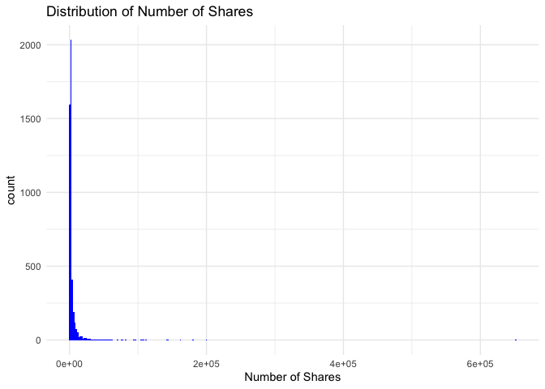
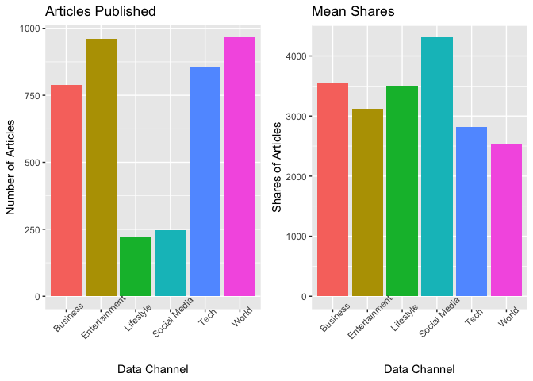
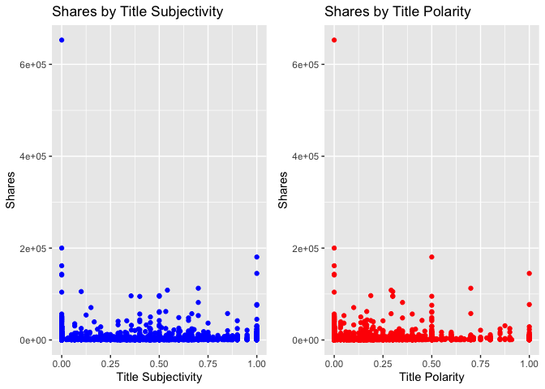
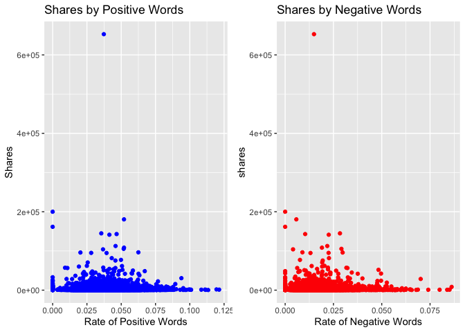
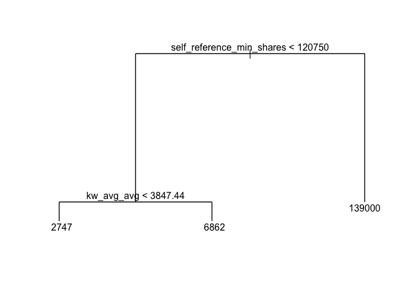

Project 2- Robyn Lewis
================
Robyn Lewis
10/4/2020

Introduction
============

describe data and variables, purpose of analysis

For this project, we’ll be analyzing the popularity of articles
published on [Mashable](mashable.com). Popularity is determined by
number of shares, with 1400 or interactions considered popular. Our data
is available through the [UCI Machine Learning
Repository](https://archive.ics.uci.edu/ml/datasets/Online+News+Popularity),
and consists of 39,644 observations of 61 variables. These variables
describe numerous attributes of the articles, including the number of
words in the title and content, average length of words, subjectivity
and polarity of the articles. It also assigns each article to a topic or
data channel and indicates on which day of the week it was published.

    #read in with relative path
    newsData <- read_csv("./Raw Data/OnlineNewsPopularity.csv")

    ## Parsed with column specification:
    ## cols(
    ##   .default = col_double(),
    ##   url = col_character()
    ## )

    ## See spec(...) for full column specifications.

    #need to consolidate weekday_is_* variables into one column. 
    dayOfWeek <- rep(NA, nrow(newsData))
    dayNames <- c("Monday", "Tuesday", "Wednesday", "Thursday", "Friday", "Saturday", "Sunday")

    for (i in 1:nrow(newsData)){
      for(j in 32:38){
        if(newsData[i,j]==1){dayOfWeek[i] <- dayNames[j-31]}
      }
    }
    newsData <- cbind(newsData, dayOfWeek)

    #clean up the data set a bit for regression analysis- get rid of URL and weekday_is_*
    newsData <- newsData[, -c(1, 32:39)]

    #suggestion to look at just Monday data first
    oneDayData <- newsData %>% filter(dayOfWeek==params$day)

    #create training data set (70%) and test set (30%)
    set.seed(1)
    train <- sample(1:nrow(oneDayData), size=nrow(oneDayData)*0.7)
    test <- dplyr::setdiff(1:nrow(oneDayData), train)

    newsDataTrain <- oneDayData[train,]
    newsDataTest <- oneDayData[test,]

Summarizations
==============

First we’ll examine numerical summaries of selected attributes for the
articles- number of words in the title, words in the content, links,
images, and vidoes.

    #numerical summaries of attributes

    newsDataTrain %>% select(c(2, 3, 7, 9, 10)) %>% sapply(summary) %>% kable(digits=2, caption="Numeric Summaries of Article Attributes", col.names=c("Words in Title", "Words in Content", "Links", "Images", "Videos"))

|         | Words in Title | Words in Content |  Links | Images | Videos |
|:--------|---------------:|-----------------:|-------:|-------:|-------:|
| Min.    |           2.00 |             0.00 |   0.00 |   0.00 |   0.00 |
| 1st Qu. |           9.00 |           248.00 |   4.00 |   1.00 |   0.00 |
| Median  |          10.00 |           397.50 |   7.00 |   1.00 |   0.00 |
| Mean    |          10.42 |           538.24 |  10.62 |   4.38 |   1.37 |
| 3rd Qu. |          12.00 |           711.00 |  13.00 |   3.00 |   1.00 |
| Max.    |          18.00 |          7764.00 | 162.00 |  93.00 |  74.00 |

Numeric Summaries of Article Attributes

Now we’ll look at a histogram of the number of shares for articles. Note
that this will be affected greatly by major outliers.

    ggplot(data=newsDataTrain, aes(x=shares)) +
      geom_histogram(binwidth = 2000, fill="blue") +
      labs(title="Distribution of Number of Shares", x="Number of Shares")+
      theme_minimal()

<!-- -->

Next we’ll look at articles broken down by category. Here we can
visualize the total number of published articles by category, as well as
the mean number of shares of articles from each category.

    b1 <- ggplot(data=counts, aes(x=data.channel, y=article.count)) +
      geom_bar(stat="identity", aes(fill=as.factor(data.channel))) +
      labs(title="Articles Published", x="Data Channel", y="Number of Articles") +
      theme(legend.position = "none", axis.text.x=element_text(angle=45))

    b2 <- ggplot(data=share.by, aes(x=data.channel, y=shares.by)) +
      geom_bar(stat="identity", aes(fill=as.factor(data.channel))) +
      labs(title="Mean Shares", x="Data Channel", y="Shares of Articles") +
      theme(legend.position = "none", axis.text.x=element_text(angle=45))

    grid.arrange(b1, b2, nrow=1)

<!-- -->

We will also look at number of shares compared to how the title ranks in
both subjectivity and polarity. Articles are assigned a value for each
on a scale of 0 to 1.

    s1 <- ggplot(data=newsDataTrain, aes(y=shares)) +
      geom_point(aes(x=title_subjectivity), color="blue") +
      labs(title="Shares by Title Subjectivity", x= "Title Subjectivity", y="Shares")

    s2 <- ggplot(data=newsDataTrain, aes(y=shares)) +
      geom_point(aes(x=abs_title_sentiment_polarity), color="red") +
      labs(title="Shares by Title Polarity", x= "Title Polarity", y="Shares")

    grid.arrange(s1, s2, nrow=1)

<!-- -->

Now we will assess the rates of both positive words and negative words
in the content of the articles.

    b1 <- ggplot(data=newsDataTrain, aes(y=shares, x=global_rate_positive_words)) +
      geom_point(color="blue") +
      labs(title="Shares by Positive Words", x="Rate of Positive Words", y="Shares") +
      theme(legend.position = "none")

    b2 <- ggplot(data=newsDataTrain, aes(y=shares, x=global_rate_negative_words)) +
      geom_point(color="red") +
      labs(title="Shares by Negative Words", x="Rate of Negative Words", y="shares") +
      theme(legend.position = "none")

    grid.arrange(b1, b2, nrow=1)

<!-- --> \#
Modeling

First we’ll fit a regression tree model using leave one out cross
validation (LOOCV).

    #tree based model, chosen using leave one out cross validation

    #formulate our training models
    treeFit <- tree(shares~., data=newsDataTrain)
    summary(treeFit)

    ## 
    ## Regression tree:
    ## tree(formula = shares ~ ., data = newsDataTrain)
    ## Variables actually used in tree construction:
    ## [1] "self_reference_min_shares" "kw_avg_avg"               
    ## Number of terminal nodes:  3 
    ## Residual mean deviance:  153800000 = 7.168e+11 / 4659 
    ## Distribution of residuals:
    ##      Min.   1st Qu.    Median      Mean   3rd Qu.      Max. 
    ## -137800.0   -2003.0   -1547.0       0.0    -446.6  513900.0

    plot(treeFit)
    text(treeFit, pretty=0)

<!-- -->

    #cross validate, K=n is LOOCV
    cv.treeFit <- cv.tree(treeFit)
    cv.treeFit

    ## $size
    ## [1] 3 2 1
    ## 
    ## $dev
    ## [1] 825722524762 840331871050 840274218036
    ## 
    ## $k
    ## [1]        -Inf 11745665602 91735314491
    ## 
    ## $method
    ## [1] "deviance"
    ## 
    ## attr(,"class")
    ## [1] "prune"         "tree.sequence"

Next we will construct a model using a Boosted Tree method.

    boostTreeFit2 <- gbm(shares~.-dayOfWeek, data=newsDataTrain, distribution="gaussian", n.trees=50, interaction.depth = 3, shrinkage = 0.1, n.minobsinnode = 10)

### Secondary analysis by kmlopez

Project Part 2: Add in a linear regression model of your choice (no need
to do variable selection, just pick a model) to the modeling section.
Add in the predictions of the model on the test set.

    #second file provided by owner, edited here to include my code but can't evaluate because of too many errors
    #linear regression model
    fitLM <- lm(shares ~ . -dayOfWeek, data = newsDataTrain)
    fitLM #view the result
    plot(fitLM) #view the plot

    #prediction on the test set
    predLM <- predict(fitLM, newdata = newsDataTest, se.fit = TRUE)
    predLM #view the result with standard errors $se.fit

Predictions
===========

Now we will test our models on the reserved testing data set.

    treePrediction <- predict(treeFit, newdata=newsDataTest)
    treeRMSE <- sqrt(mean((treePrediction-newsDataTest$shares)^2))

    boostPrediction <- predict(boostTreeFit2, newdata=newsDataTest, n.trees=50)
    boostRMSE <- sqrt(mean((boostPrediction-newsDataTest$shares)^2))

Final Model
===========

For our final model, we will pick the model with lowest RMSE.

    RMSEs <- c(treeRMSE, boostRMSE)
    kable(t(RMSEs), col.names = c("Regression Tree", "Boosted Tree"), caption = "RMSEs of the Models")

| Regression Tree | Boosted Tree |
|----------------:|-------------:|
|        18251.86 |     17591.35 |

RMSEs of the Models

Packages used
=============

    citation(package="class")

    ## 
    ## To cite the class package in publications use:
    ## 
    ##   Venables, W. N. & Ripley, B. D. (2002) Modern Applied Statistics with
    ##   S. Fourth Edition. Springer, New York. ISBN 0-387-95457-0
    ## 
    ## A BibTeX entry for LaTeX users is
    ## 
    ##   @Book{,
    ##     title = {Modern Applied Statistics with S},
    ##     author = {W. N. Venables and B. D. Ripley},
    ##     publisher = {Springer},
    ##     edition = {Fourth},
    ##     address = {New York},
    ##     year = {2002},
    ##     note = {ISBN 0-387-95457-0},
    ##     url = {http://www.stats.ox.ac.uk/pub/MASS4},
    ##   }

    citation(package="tree")

    ## 
    ## To cite package 'tree' in publications use:
    ## 
    ##   Brian Ripley (2019). tree: Classification and Regression Trees. R
    ##   package version 1.0-40. https://CRAN.R-project.org/package=tree
    ## 
    ## A BibTeX entry for LaTeX users is
    ## 
    ##   @Manual{,
    ##     title = {tree: Classification and Regression Trees},
    ##     author = {Brian Ripley},
    ##     year = {2019},
    ##     note = {R package version 1.0-40},
    ##     url = {https://CRAN.R-project.org/package=tree},
    ##   }

    citation(package="caret")

    ## 
    ## To cite package 'caret' in publications use:
    ## 
    ##   Max Kuhn (2020). caret: Classification and Regression Training. R
    ##   package version 6.0-86. https://CRAN.R-project.org/package=caret
    ## 
    ## A BibTeX entry for LaTeX users is
    ## 
    ##   @Manual{,
    ##     title = {caret: Classification and Regression Training},
    ##     author = {Max Kuhn},
    ##     year = {2020},
    ##     note = {R package version 6.0-86},
    ##     url = {https://CRAN.R-project.org/package=caret},
    ##   }

    citation(package="tidyverse")

    ## 
    ##   Wickham et al., (2019). Welcome to the tidyverse. Journal of Open
    ##   Source Software, 4(43), 1686, https://doi.org/10.21105/joss.01686
    ## 
    ## A BibTeX entry for LaTeX users is
    ## 
    ##   @Article{,
    ##     title = {Welcome to the {tidyverse}},
    ##     author = {Hadley Wickham and Mara Averick and Jennifer Bryan and Winston Chang and Lucy D'Agostino McGowan and Romain François and Garrett Grolemund and Alex Hayes and Lionel Henry and Jim Hester and Max Kuhn and Thomas Lin Pedersen and Evan Miller and Stephan Milton Bache and Kirill Müller and Jeroen Ooms and David Robinson and Dana Paige Seidel and Vitalie Spinu and Kohske Takahashi and Davis Vaughan and Claus Wilke and Kara Woo and Hiroaki Yutani},
    ##     year = {2019},
    ##     journal = {Journal of Open Source Software},
    ##     volume = {4},
    ##     number = {43},
    ##     pages = {1686},
    ##     doi = {10.21105/joss.01686},
    ##   }

    citation(package="dplyr")

    ## 
    ## To cite package 'dplyr' in publications use:
    ## 
    ##   Hadley Wickham, Romain François, Lionel Henry and Kirill Müller
    ##   (2020). dplyr: A Grammar of Data Manipulation. R package version
    ##   1.0.2. https://CRAN.R-project.org/package=dplyr
    ## 
    ## A BibTeX entry for LaTeX users is
    ## 
    ##   @Manual{,
    ##     title = {dplyr: A Grammar of Data Manipulation},
    ##     author = {Hadley Wickham and Romain François and Lionel {
    ##              Henry} and Kirill Müller},
    ##     year = {2020},
    ##     note = {R package version 1.0.2},
    ##     url = {https://CRAN.R-project.org/package=dplyr},
    ##   }

    citation(package="ggplot2")

    ## 
    ## To cite ggplot2 in publications, please use:
    ## 
    ##   H. Wickham. ggplot2: Elegant Graphics for Data Analysis.
    ##   Springer-Verlag New York, 2016.
    ## 
    ## A BibTeX entry for LaTeX users is
    ## 
    ##   @Book{,
    ##     author = {Hadley Wickham},
    ##     title = {ggplot2: Elegant Graphics for Data Analysis},
    ##     publisher = {Springer-Verlag New York},
    ##     year = {2016},
    ##     isbn = {978-3-319-24277-4},
    ##     url = {https://ggplot2.tidyverse.org},
    ##   }

    citation(package="gridExtra")

    ## 
    ## To cite package 'gridExtra' in publications use:
    ## 
    ##   Baptiste Auguie (2017). gridExtra: Miscellaneous Functions for "Grid"
    ##   Graphics. R package version 2.3.
    ##   https://CRAN.R-project.org/package=gridExtra
    ## 
    ## A BibTeX entry for LaTeX users is
    ## 
    ##   @Manual{,
    ##     title = {gridExtra: Miscellaneous Functions for "Grid" Graphics},
    ##     author = {Baptiste Auguie},
    ##     year = {2017},
    ##     note = {R package version 2.3},
    ##     url = {https://CRAN.R-project.org/package=gridExtra},
    ##   }

    citation(package="rmarkdown")

    ## 
    ## To cite the 'rmarkdown' package in publications, please use:
    ## 
    ##   JJ Allaire and Yihui Xie and Jonathan McPherson and Javier Luraschi
    ##   and Kevin Ushey and Aron Atkins and Hadley Wickham and Joe Cheng and
    ##   Winston Chang and Richard Iannone (2020). rmarkdown: Dynamic
    ##   Documents for R. R package version 2.3. URL
    ##   https://rmarkdown.rstudio.com.
    ## 
    ##   Yihui Xie and J.J. Allaire and Garrett Grolemund (2018). R Markdown:
    ##   The Definitive Guide. Chapman and Hall/CRC. ISBN 9781138359338. URL
    ##   https://bookdown.org/yihui/rmarkdown.
    ## 
    ## To see these entries in BibTeX format, use 'print(<citation>,
    ## bibtex=TRUE)', 'toBibtex(.)', or set
    ## 'options(citation.bibtex.max=999)'.

    citation(package="knitr")

    ## 
    ## To cite the 'knitr' package in publications use:
    ## 
    ##   Yihui Xie (2020). knitr: A General-Purpose Package for Dynamic Report
    ##   Generation in R. R package version 1.29.
    ## 
    ##   Yihui Xie (2015) Dynamic Documents with R and knitr. 2nd edition.
    ##   Chapman and Hall/CRC. ISBN 978-1498716963
    ## 
    ##   Yihui Xie (2014) knitr: A Comprehensive Tool for Reproducible
    ##   Research in R. In Victoria Stodden, Friedrich Leisch and Roger D.
    ##   Peng, editors, Implementing Reproducible Computational Research.
    ##   Chapman and Hall/CRC. ISBN 978-1466561595
    ## 
    ## To see these entries in BibTeX format, use 'print(<citation>,
    ## bibtex=TRUE)', 'toBibtex(.)', or set
    ## 'options(citation.bibtex.max=999)'.

    citation(package= "utils")

    ## 
    ## The 'utils' package is part of R.  To cite R in publications use:
    ## 
    ##   R Core Team (2020). R: A language and environment for statistical
    ##   computing. R Foundation for Statistical Computing, Vienna, Austria.
    ##   URL https://www.R-project.org/.
    ## 
    ## A BibTeX entry for LaTeX users is
    ## 
    ##   @Manual{,
    ##     title = {R: A Language and Environment for Statistical Computing},
    ##     author = {{R Core Team}},
    ##     organization = {R Foundation for Statistical Computing},
    ##     address = {Vienna, Austria},
    ##     year = {2020},
    ##     url = {https://www.R-project.org/},
    ##   }
    ## 
    ## We have invested a lot of time and effort in creating R, please cite it
    ## when using it for data analysis. See also 'citation("pkgname")' for
    ## citing R packages.

Data Source Used:

K. Fernandes, P. Vinagre and P. Cortez. A Proactive Intelligent Decision
Support System for Predicting the Popularity of Online News. Proceedings
of the 17th EPIA 2015 - Portuguese Conference on Artificial
Intelligence, September, Coimbra, Portugal.
